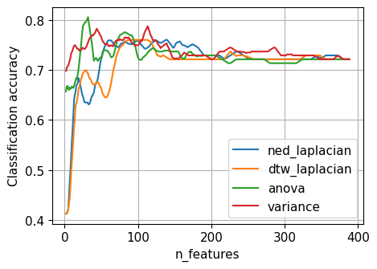

# Laplacian score for time series

Authors: Jérémie Dentan and Gonzague De Carpentier

  

## Overview

This repository contains the implentation of the work of the author for a paper review. The goal of this review it to evaluate the performance of a filter method for feature selection based on Laplacian score.

For details about this review, please refer to:

- Our report: [https://github.com/decarpentierg/laplacian-score-4-time-series/blob/main/doc/report.pdf](https://github.com/decarpentierg/laplacian-score-4-time-series/blob/main/doc/report.pdf)
- Our slides [https://github.com/decarpentierg/laplacian-score-4-time-series/blob/main/doc/defense.pdf](https://github.com/decarpentierg/laplacian-score-4-time-series/blob/main/doc/defense.pdf)
- The original paper: [https://proceedings.neurips.cc/paper/2005/hash/b5b03f06271f8917685d14cea7c6c50a-Abstract.html](https://proceedings.neurips.cc/paper/2005/hash/b5b03f06271f8917685d14cea7c6c50a-Abstract.html)

## Re-running our experiments

To re-run our experiments, we invite you to have a look to [doc/evaluate_laplacian_score.ipynb](doc/evaluate_laplacian_score.ipynb). This notebook uses functions whose source code are in `src/` to run some experiments on the feature selection method.

## License and Disclaimer

You may use this software under the Apache 2.0 License. See LICENSE.